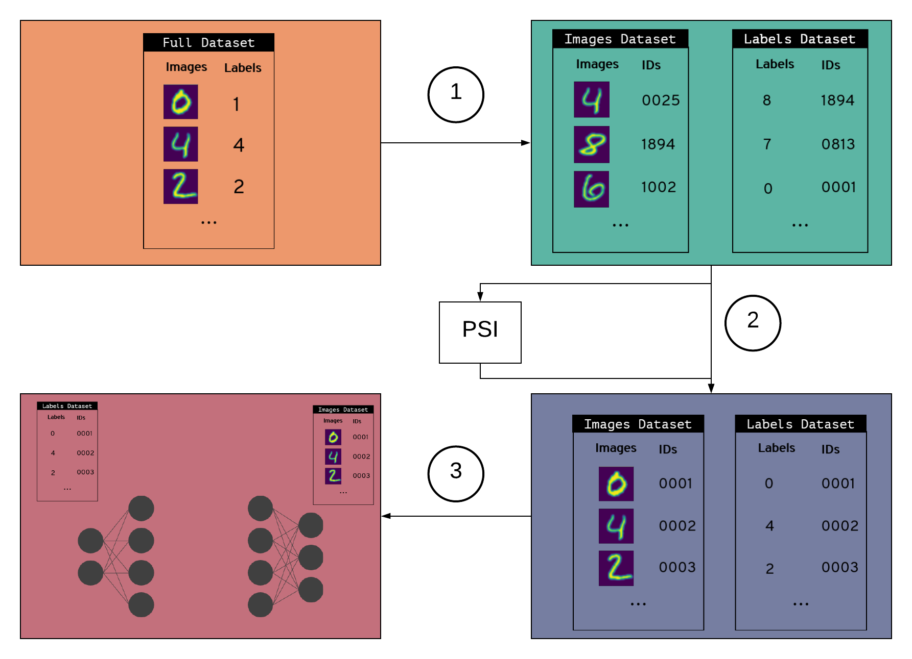

# PyVertical

A project developing privacy-preserving,
vertical federated learning,
using [`syft`](syft).

- :link: Private entity resolution
         using Private Set Intersection (PSI)
- :lock: Trains a model on vertically partitioned data
        using SplitNNs,
        so only data holders can access data

Vertically-partitioned data is data
in which
fields relating to a single record
are distributed across multiple datasets.
For example,
multiple hospitals may have admissions data on the same patients,
or retailers have transaction data on the same shoppers.
Vertically-partitioned data could be applied to solve vital problems,
but data holders can't combine their datasets
by simply comparing notes with other data holders
unless they want to break user privacy.
`PyVertical` uses [PSI]
to link datasets in a privacy-preserving way.
We train SplitNNs on the partitioned data
to ensure the data remains separate throughout the entire process.

See the [changelog](./CHANGELOG.md)
for information
on the current status of `PyVertical`.

**NOTE: PyVertical does not currently work with `syft 0.3.0`**

## The Process

PyVertical process:
1. Create partitioned dataset
    - Simulate real-world partitioned dataset by splitting MNIST into a dataset of images and a dataset of labels
    - Give each data point (image + label) a unique ID
    - Randomly shuffle each dataset
    - Randomly remove some elements from each dataset
1. Link datasets using PSI
    - Use **PSI** to link indices in each dataset using unique IDs
    - Reorder datasets using linked indices
1. Train a split neural network
    - Hold both datasets in a dataloader
    - Send images to first part of split network
    - Send labels to second part of split network
    - Train the network

## Requirements

### OS

| Windows | Linux | MacOS |
|:--:|:--:|:--:|
| :x: | :heavy_check_mark: | :heavy_check_mark: |

The Windows `PyTorch version 1.4.0` is experiencing issues.
It cannot be updated on a working version, until `Syft` will be updated, too.

### Python

| `3.6` | `3.7` | `3.8` | `3.9` |
| ------|-------|-------|-------|
| :heavy_check_mark: | :heavy_check_mark: | :heavy_check_mark: | :x: |

[syft] and [PSI]
upstream dependencies do not have `Python 3.9`
packages.

### PyTorch Environment

To install the dependencies,
we recommend using [Conda]:
1. Clone this repository
1. In the command line, navigate to your local copy of the repository
1. Run `conda env create -f environment.yml`
    - This creates an environment `pyvertical-dev`
    - Comes with most dependencies you will need
1. Activate the environment with `conda activate pyvertical-dev`
1. Run `conda install notebook`

N.b. Installing the dependencies takes several steps to circumvent versioning incompatibility between
`syft` and `jupyter`.
In the future,
all packages will be moved into the `environment.yml`.

### Tensorflow Environment

To install the dependencies,
we recommend using [Conda]:
1. Clone this repository
1. In the command line, navigate to your local copy of the repository
1. Run `conda env create -f tf_environment.yml`
    - This creates an environment `pyvertical-dev-tf`
    - Comes with most dependencies you will need
1. Activate the environment with `conda activate pyvertical-dev-tf`
1. Run `conda install notebook`

### Docker

You can instead opt to use Docker.

To run:

1. Build the image with `docker build -t pyvertical:latest .`
1. Launch a container with `docker run -it -p 8888:8888 pyvertical:latest`
    - Defaults to launching jupyter lab

### Synthea

`PyVertical` is applying fake medical data
generated by [synthea]
to demonstrate multi-party,
vertical federated learning.
Read the [synthea] docs
for requirements to generate the data.
With those pre-requisites installed,
run the `scripts/download_synthea.sh`
bash script
from the root directory
of this project,
which generates a deterministic dataset
and stores it in `data/synthea`.

## Usage

Check out
[`examples/PyVertical Example.ipynb`](examples/PyVertical%20Example.ipynb)
to see `PyVertical` in action.

## Goals

- [X] MVP
    - Simple example on MNIST dataset
    - One data holder has images, the other has labels
- [ ] Extension demonstration
    - Apply process to electronic health records (EHR) dataset
    - Dual-headed SplitNN: input data is split amongst several data holders
- [ ] Integrate with [`syft`](https://www.github.com/OpenMined/PySyft)

## Contributing
Pull requests are welcome.
For major changes,
please open an issue first to discuss what you would like to change.

Read the OpenMined
[contributing guidelines][contrib]
and [styleguide](https://github.com/OpenMined/.github/blob/master/STYLEGUIDE.md)
for more information.

## Contributors
|  [][ttitcombe] | [][pavlos-p]  | [][h4ll] | [][rsandmann] | [][daler3]
| :--:|:--: |:--:|:--:|:--:|
|  [TTitcombe] | [Pavlos-p]  | [H4LL] | [rsandmann] | [daler3] 

## Testing
We use [`pytest`][pytest] to test the source code.
To run the tests manually:
1. In the command line, navigate to the root of this repository
1. Run `python -m pytest`

CI also checks the code is formatting according to [contributing guidelines][contrib].

## Publications
Romanini, D., Hall, A. J., Papadopoulos, P., Titcombe, T., Ismail, A., Cebere, T., Sandmann, R., Roehm, R. & Hoeh, M. A. (2021). PyVertical: A Vertical Federated Learning Framework for Multi-headed SplitNN. arXiv preprint arXiv:2104.00489. ([link](https://arxiv.org/abs/2104.00489))

Angelou, N., Benaissa, A., Cebere, B., Clark, W., Hall, A. J., Hoeh, M. A., Liu, D., Papadopoulos, P., Roehm, R., Sandmann, R., Schoppmann, P. & Titcombe, T. (2020). Asymmetric Private Set Intersection with Applications to Contact Tracing and Private Vertical Federated Machine Learning. arXiv preprint arXiv:2011.09350. ([link](https://arxiv.org/abs/2011.09350))

You can cite this work using:

    @article{romanini2021pyvertical,
        title={PyVertical: A Vertical Federated Learning Framework for Multi-headed SplitNN},
        author={Romanini, Daniele and Hall, Adam James and Papadopoulos, Pavlos and Titcombe, Tom and Ismail, Abbas and Cebere, Tudor and Sandmann, Robert and Roehm, Robin and Hoeh, Michael A},
        journal={arXiv preprint arXiv:2104.00489},
        year={2021}
    }

    @article{angelou2020asymmetric,
        title={Asymmetric Private Set Intersection with Applications to Contact Tracing and Private Vertical Federated Machine Learning},
        author={Angelou, Nick and Benaissa, Ayoub and Cebere, Bogdan and Clark, William and Hall, Adam James and Hoeh, Michael A and Liu, Daniel and Papadopoulos, Pavlos and Roehm, Robin and Sandmann, Robert and others},
        journal={arXiv preprint arXiv:2011.09350},
        year={2020}
    }

## License
[Apache License 2.0](https://choosealicense.com/licenses/apache-2.0/)

[black]: https://black.readthedocs.io/en/stable/
[conda]: https://docs.conda.io/en/latest/
[contrib]: https://github.com/OpenMined/.github/blob/master/CONTRIBUTING.md
[flake8]: https://flake8.pycqa.org/en/latest/index.html#quickstart
[psi]: https://www.github.com/OpenMined/PSI
[pytest]: https://docs.pytest.org/en/latest/contents.html
[syft]: https://github.com/OpenMined/PySyft
[synthea]: https://github.com/synthetichealth/synthea

[ttitcombe]: https://github.com/ttitcombe
[pavlos-p]: https://github.com/pavlos-p
[h4ll]: https://github.com/h4ll
[rsandmann]: https://github.com/rsandmann
[daler3]: https://github.com/daler3
