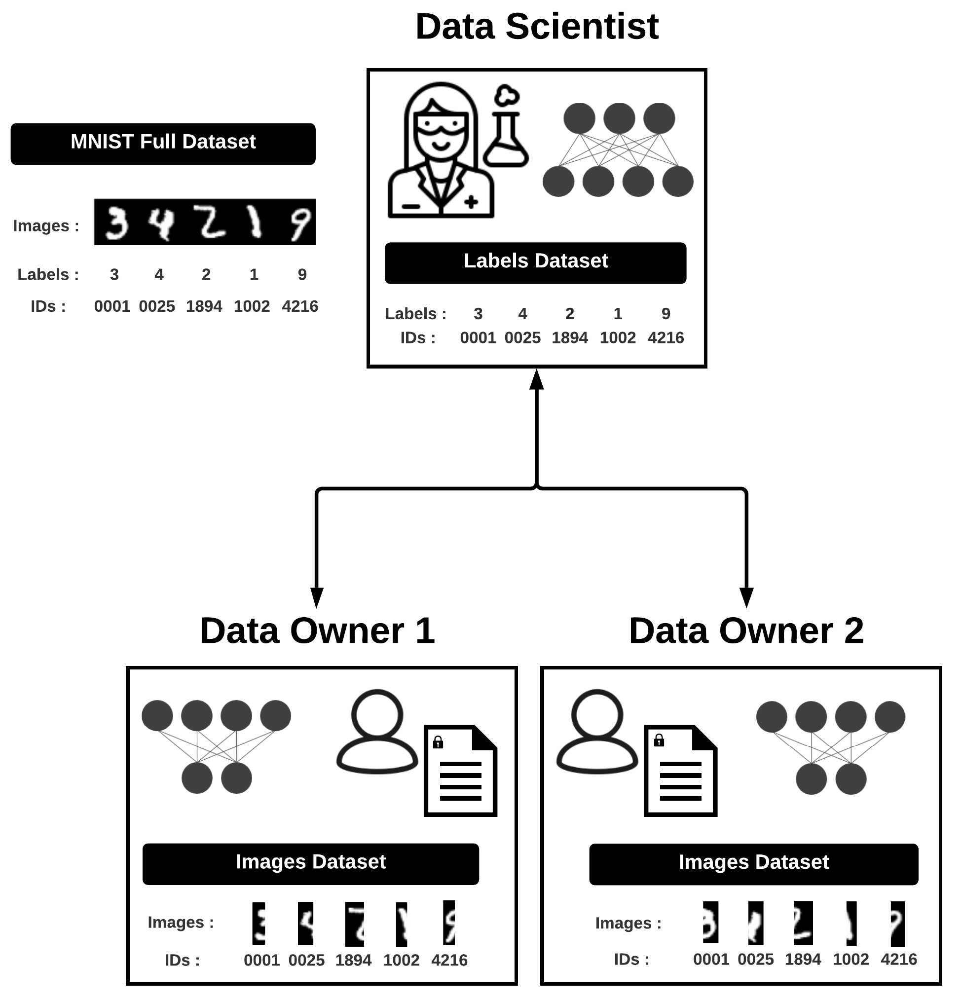

# PyVertical

We introduce PyVertical,
a library for vertical federated learning
using Split neural networks (SplitNN)
and Private Set Intersection (PSI).
PyVertical is built on
the `Duet`
framework in [`PySyft`](https://github.com/OpenMined/PySyft/),
which allows a data scientist to run computations
on a data owner's data without accessing
the raw data.
This repository contains a minimal example.
More code will be released upon publication
to preserve anonymity.

## How it works

We assume data subjects in each data owner's dataset
are attached to a unique ID.
We use PSI to identify IDs shared among the datasets.
The data owners discard data not shared
by all parties and order their datasets by ID.
No other party can access the raw IDs of a data owner,
except for the IDs shared among all parties.

Data owners control a model segment (part of a SplitNN)
to convert raw data into an abstract,
shareable representation.
Information from multiple data owners can be combined (concatenated)
and sent to a data scientist.
The data scientist completes inference
on this combined data using a separate model segment to perform classification.
The data scientist calculates loss and updates their model segment,
They then send the gradients back to the data owners,
who update their model segments.

PySyft,
upon which PyVertical is built,
only allows the data scientist to access pointers to raw data.
The data scientist controls the training process
without being able to access raw, private data.

In this demo,
only two input heads are used.
However, PyVertical is an extensible
method which could facilitate
massively multi-party VFL.

## Requirements

- **important**: The PSI library does not work on windows. Model training does work for Mac, Windows, Ubuntu (not tested on other linux distros)
- Run `pip install -r requirements.txt`
to install the Python libraries necessary for this demo.

## Experiment

We demonstrate PyVertical on a vertically-partitioned version
of the MNIST dataset.
We provide a utility function
which splits MNIST images into a left half and right half.
The left half images are held by one data owner
and the right half by another.
We assume that the data scientist has access to data labels.
Note that the models are not trained on all MNIST images to
reduce communication bandwidth.

To demonstrate the method cleanly,
we separate data linkage and federated learning
into different notebooks.
In practice, this would be done in a single notebook/script.
See the [examples](./examples) folder
for the demo.

## License

Code is released under an Apache 2.0 license
